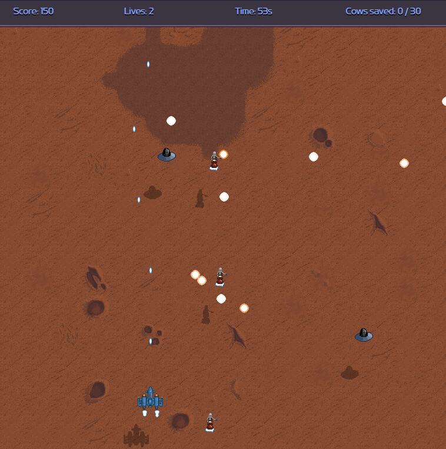

# js-game-martian
Martian Rustlers

A small browser shoot 'em up written in plain JavaScript.

**Features**

- Custom game loop (requestAnimationFrame)
- Enemy state machines and timers
- Procedural background and tiles
- Keyboard menu system and localStorage highscores
- object pooling to deal with limitations of DOM (used for tilesets, bullets, audio samples, etc)

**Why this project**

Built to practice structuring larger JavaScript codebases without frameworks.

Using DOM only was the main challenge.

**How to play**

This game uses keyboard controls only

- Arrows - to move and change menu values
- Enter - in menu only
- Spacebar - to shoot
- Holding down spacebar during intro speeds up the dialog

**Live demo**
👉 [indrek.org/game](https://indrek.org/game)

**Additional note**

Since game cycles are pretty much DIY, game speed can change due high refresh rate on your monitor.

In such case, lower to 60Hz or turn on FPS locking from main menu.